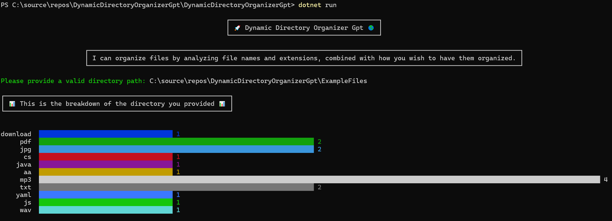
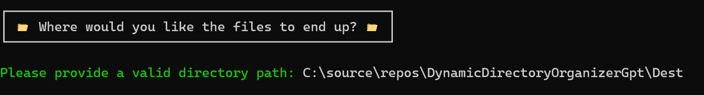
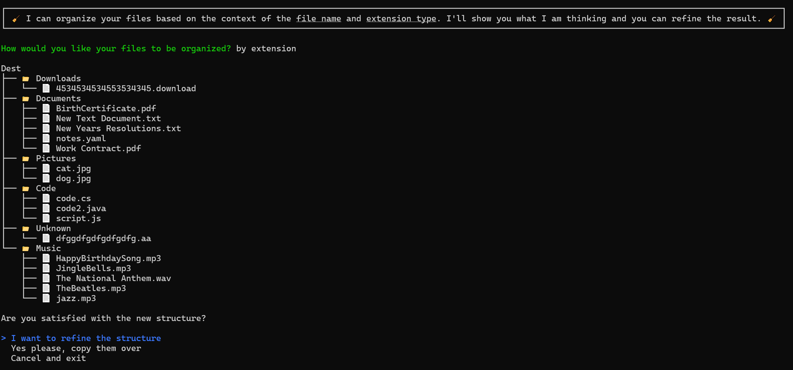

- [Dynamic Directory Organizer Gpt](#dynamic-directory-organizer-gpt)
  * [Description](#description)
  * [Demo](#demo)
  * [Getting Started](#getting-started)
    + [1. Clone](#1-clone)
    + [2. Configure](#2-configure)
    + [3. Running the Demo](#3-running-the-demo)
    + [4. The Demo](#4-the-demo)
      - [Provide a directory with the files you wish to reorganize](#provide-a-directory-with-the-files-you-wish-to-reorganize)
      - [Provide a directory where you would like the reorganized files to end up](#provide-a-directory-where-you-would-like-the-reorganized-files-to-end-up)
      - [Provide context as to how you want the files to be organized. Refine. Then copy them over!](#provide-context-as-to-how-you-want-the-files-to-be-organized-refine-then-copy-them-over-)
  * [Notes](#notes)

# Dynamic Directory Organizer Gpt

.NET 8 Hack project submission

https://devblogs.microsoft.com/dotnet/join-us-for-the-great-dotnet-8-hack/  
https://github.com/microsoft/hack-together-dotnet  

## Description

Use this app to chat with AI to organize files interactively.  
Adjust until satisfied, then select a destination for the newly structured files to be copied to.  

## Demo

This repo comes with a folder with a few example files that can be used to easily demo the app: [ExampleFiles](./ExampleFiles/)

Here are 3 videos showing some scenarios with these files:
- Organize by file extension: https://youtu.be/AOwbVkdv4Gk  
- Organize music by category: https://youtu.be/MJI3s0pfmxE  
- Automatic determination of useful files: https://youtu.be/mxw1ybvMUDA  

Thanks to AI/GPT, there are seemingly endless scenarios!  

## Getting Started

### 1. Clone

Clone the repository:

```bash
git clone https://github.com/aaronpowell/ConsoleGPT.git
```

### 2. Configure

Open in Visual Studio, VS Code, or your favorite editor.

Configure [appsettings.json](./DynamicDirectoryOrganizerGpt/appsettings.json).   

```json
{
  "settings": {
    "model": "chat",
    "endpoint": "https://<your resource>.openai.azure.com/",
    "key": "<your key>",
    "type": "azure"
  }
}
```

### 3. Running the Demo

If running in Windows, please consider running from:
- [Windows Terminal](https://apps.microsoft.com/detail/windows-terminal/9N0DX20HK701?hl=en-US&gl=US) (preferred)
- PowerShell

If you run this project from CMD, you will not be able to render the unicode graphics.  

When you are in the console, in the directory of [DynamicDirectoryOrganizerGpt.csproj](./DynamicDirectoryOrganizerGpt/DynamicDirectoryOrganizerGpt.csproj). Please run:  

```bash
dotnet run
```

### 4. The Demo

Once the app is running follow the prompts:

#### Provide a directory with the files you wish to reorganize



#### Provide a directory where you would like the reorganized files to end up



#### Provide context as to how you want the files to be organized. Refine. Then copy them over!



## Notes

- This app is non-destructive, the only system operation used is `copy`.
- LLMs often produce different results when given the same input. If you try something and it appears to fail in an unusual way, please try again.